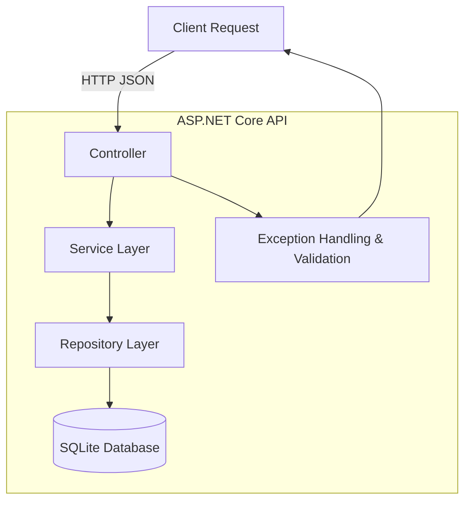

Simple TODO: A Full‑Stack Vue & .NET Core Application
=================================================

<!-- This README follows the style guidelines from the [Awesome README](https://github.com/matiassingers/awesome-readme) list. It contains an overview of the application, setup instructions, architecture diagrams, trade‑offs and next steps. -->

About this project
------------------

**Todo App** is a full‑stack application that demonstrates how to build a modern task manager using a **.NET 10** backend and **Vue 3 + Vite** frontend.\
The goal of the app is to remain as a simple to do generator and list, while still demonstrating clean architecture, solid patterns and an intuitive user interface.\
It exposes a RESTful API with standard CRUD operations and a responsive single page application (SPA) that works on both mobile and desktop.

This project started as a minimal API prototype with in-memory data and iteratively evolved into a layered architecture with controllers, service abstractions and a repository layer.\
After proving out the backend APIs, a Vue 3 UI scaffold was created with Tailwind CSS and [daisyUI](https://daisyui.com/). Initial components like **TodoList** and **TodoItem** were built, refactored and polished. I introduced a composable state management hook (`useTodos`) to encapsulate client-side business logic.\
Final touches include form validation, robust error handling, sorting logic on the repository layer and automated migrations for multiple domain model iterations, and some UI tweaking to make it feel nice to use. Some trade‑offs were made between time and scope (see Trade‑offs and Next steps) to put out the first iteration of this in a week.

### Tools & References

This app relies on a number of open‑source tools and frameworks. Links below point to the documentation or homepage of each technology:

| Area | Tools |
| --- | --- |
| **Backend** | [](https://dotnet.microsoft.com/en-us/download/dotnet/10.0) [](https://learn.microsoft.com/en-us/aspnet/core/overview?view=aspnetcore-10.0) [](https://learn.microsoft.com/en-us/ef/core/) [](https://www.sqlite.org/index.html) [](https://xunit.net/) |
| **Frontend** | [](https://vuejs.org/) [](https://vitejs.dev/) [](https://www.typescriptlang.org/) [](https://tailwindcss.com/) [](https://daisyui.com/) [](https://router.vuejs.org/) |
| **Development** | [](https://code.visualstudio.com/) [](https://eslint.org/) [](https://prettier.io/) [](https://github.com/motdotla/dotenv) |

> **Share the project:** You can star or fork this repository directly on GitHub or use the social buttons below to share it with others.

[](https://x.com/intent/tweet?text=Check%20out%20this%20project%20on%20GitHub:%20https://github.com/ohmnoms/todo-app%20%23TodoApp%20%23VueJS%20%23DotNet)
[](https://www.facebook.com/sharer/sharer.php?u=https://github.com/ohmnoms/todo-app)
[](https://www.linkedin.com/sharing/share-offsite/?url=https://github.com/ohmnoms/todo-app)
[](https://www.reddit.com/submit?title=Check%20out%20this%20project%20on%20GitHub:%20https://github.com/ohmnoms/todo-app)
[](https://t.me/share/url?url=https://github.com/ohmnoms/todo-app&text=Check%20out%20this%20project%20on%20GitHub)


Backend architecture
--------------------

The backend is a **.NET 10** ASP.NET Core Web API that follows a **layered architecture** with clear separation of concerns. Controllers handle HTTP requests and responses, a service layer encapsulates business logic, a repository layer abstracts persistence, and `Entity Framework Core` manages database access. Authentication is intentionally omitted; instead, a client‑side "device ID" is supplied with each request and used to isolate a user's todos. Exceptions are mapped to RFC 7807 problem details via a middleware. SQLite is used as the default database for simplicity and can be swapped for SQL Server via configuration.



-   **Controllers** -- define RESTful endpoints (`GET`, `POST`, `PUT`, `DELETE`) and map to methods on `ITodoItemsService`. They specify request and response types for OpenAPI and use dependency injection.

-   **Services** -- implement `ITodoItemsService` and contain validation and business logic. They verify required fields (such as `CreatedBy`), throw exceptions (`KeyNotFoundException`, `AuthenticationException`, etc.) and map domain entities to DTOs.

-   **Persistence** -- the `TodoItemsRepository` encapsulates data access using `Entity Framework Core`. It applies server‑side filtering on `CreatedBy` and `IsCompleted` and performs in‑memory sorting due to SQLite's limitations [(see repository comment)](https://github.com/ohmnoms/todo-app/blob/initial-branch/backend/Todo.Api/Persistence/TodoItemsRepository.cs#L34-L42). Migrations run automatically at startup and persist data to `todos.db`.

-   **Models** -- domain models (`TodoItem`) and contract models (`CreateTodoRequest`, `UpdateTodoRequest`) are defined as record types for immutability ([TodoItem](https://github.com/ohmnoms/todo-app/blob/initial-branch/backend/Todo.Api/Models/Domain/TodoItem.cs#L8-L61), [CreateTodoRequest](https://github.com/ohmnoms/todo-app/blob/initial-branch/backend/Todo.Api/Models/Contracts/CreateTodoRequest.cs#L4-L26), [UpdateTodoRequest](https://github.com/ohmnoms/todo-app/blob/initial-branch/backend/Todo.Api/Models/Contracts/UpdateTodoRequest.cs#L5-L32), [TodoItemResponseDTO](https://github.com/ohmnoms/todo-app/blob/initial-branch/backend/Todo.Api/Models/Contracts/TodoItemResponseDTO.cs#L7-L40)

-   **Validation** -- static validators ensure that titles are not empty or too long and due dates are not in the past [(TodoItemValidator)](https://github.com/ohmnoms/todo-app/blob/initial-branch/backend/Todo.Api/Validation/TodoItemValidator.cs). Validation errors bubble up through a custom `ValidationException` and are returned in the problem details payload.

-   **Exception handling** -- middleware catches and logs all exceptions, translating them into appropriate HTTP status codes and RFC 7807 problem details [(ExceptionHandler)](https://github.com/ohmnoms/todo-app/blob/initial-branch/backend/Todo.Api/Common/ExceptionHandler.cs#L21-L44).

-   **Configuration** -- `Program.cs` wires everything together: it adds controllers, Swagger UI, health checks, CORS and dependency injection for repository and service layers [(Program.cs)](https://github.com/ohmnoms/todo-app/blob/initial-branch/backend/Todo.Api/Program.cs). The API listens on `http://localhost:5003` and `https://localhost:7196` for development[(vscode launchSettings)](https://github.com/ohmnoms/todo-app/blob/initial-branch/backend/Todo.Api/Properties/launchSettings.json#L8-L18).

Frontend architecture
---------------------

The frontend is a **Vue 3** single page application bootstrapped with **Vite** and written in **TypeScript**. It adheres to the Composition API and uses **Tailwind CSS** with **daisyUI** for styling. The client interacts with the backend via a small service layer and uses composables for state management. All state and API logic live in TypeScript, while templates are kept declarative.

```mermaid
graph TD
  Router[Vue Router] -->|navigates| Views[Views]
  Views -->|compose| Components[UI Components]
  Components -->|call| Composables[Composables (useTodos, useApi)]
  Composables -->|fetch| Services[HTTP Service]
  Services -->|REST| API[(ASP.NET Core API)]
  Components -->|style| Tailwind[daisyUI & Tailwind CSS]
```

-   **App & routing** -- `App.vue` sets up the layout and theme switcher. Vue Router defines navigation (if extended beyond a single page) and lazy loads views.

-   **Components** -- `TodoList` renders the list of todos with infinite scroll and skeleton loaders; `TodoItem` handles inline editing, toggling completion and deletion; `AddTodo` is a controlled input form with keyboard shortcuts and validation. Additional UI helpers like `LoadingSpinner` and `ErrorAlert` improve UX.

-   **Services & composables** -- `todoService` wraps `fetch` calls to the API and abstracts details of HTTP requests, while `useApi` adds error interception and retry logic. `useTodos` maintains a reactive array of todos, exposes CRUD functions and drives optimistic UI updates.

-   **Types** -- TypeScript interfaces mirror the backend contracts to ensure type safety.

-   **Styling** -- Tailwind CSS and daisyUI provide semantic colors, dark/light themes and responsive breakpoints. Components are mobile‑first and accessible.

Getting started
---------------

The following steps assume you're using **Visual Studio Code** (VS Code) as your IDE, though any code editor will work. The application requires **[.NET 10 SDK](https://dotnet.microsoft.com/en-us/download/dotnet/10.0)**, **[Node.js ^20.19.0 or >=22.12.0](https://nodejs.org/en)** and **[npm](https://docs.npmjs.com/downloading-and-installing-node-js-and-npm)**.

### 1 - Clone the repository

```shell
git clone https://github.com/ohmnoms/todo-app.git
cd todo-app
git checkout initial-branch
```

### 2 - Install dependencies

The solution consists of two projects: a backend API and a Vue frontend.

#### Backend (.NET API)

```shell
cd backend/Todo.Api
dotnet restore
```

#### Frontend (Vue)

```shell
cd ../../frontend/todo-app
npm install
```

### 3 - Recommended VS Code extensions

To get the best developer experience, use [VS Code](https://code.visualstudio.com/download) and install all recommended extensions. *Recommended extensions are all in `extensions.json` as recommended extensions in the `.vscode` folder. Some include:*

| Extension | Purpose |
| --- | --- |
| **C# (OmniSharp)** | Provides IntelliSense, debugging and task launching for .NET projects |
| **Vue Language Features (Volar)** | Rich support for `.vue` files and TypeScript |
| **ESLint** | Lints JavaScript/TypeScript and Vue code |
| **Prettier -- Code Formatter** | Formats code consistently across projects |
| **SQLite Viewer** (optional) | Allows browsing the local `todos.db` file |

After installing the extensions, open the repository folder in VS Code. The integrated terminal will recognize the `task.json` and `launch.json` files and provide tasks for running and debugging the application.

### 4 - Running the App
You can run the frontend and backend directly in VS Code via the `Run + Debug` side nav option (`Ctrl + Shift + D` on Windows) using the `API + Web` launch configuration. F5 will start debugging when this configuration is selected. Select the configuration from the dropdown next to the green arrow run button when the `Run + Debug` nav item is selected.

For running components individually:

#### Running the API

The API uses SQLite and will automatically create and migrate the database on first run. 

You can run the api directly with a watch using the `API - .NET (watch)` configuration from `Run + Debug`, or use the following command from the **backend/Todo.Api** directory in terminal:

```shell
dotnet run
```

By default, the API listens on `http://localhost:5003`. Swagger UI is enabled in development mode; navigate to that domain to explore and test the endpoints. You can also press **F5** in VS Code to launch your .NET API if you have a matching launch configuration.

### 5 - Running the frontend

From the **frontend/todo-app** directory, start the development server:

`npm run dev`

This launches Vite on `http://localhost:5173` and proxies API requests to `http://localhost:5003`. The page will reload on save and display compilation errors in the browser overlay. To debug the frontend, install the [Vue.js devtools](https://chromewebstore.google.com/detail/vuejs-devtools/nhdogjmejiglipccpnnnanhbledajbpd) extension in your browser and open the **DevTools** panel. You can also press **F5** in VS Code to launch a Chrome instance attached to your Vue app if you have a matching launch configuration.

### 6 - Testing the API

The project includes unit tests written with **xUnit** and **Moq**. To run the tests:

```shell
cd backend/Todo.Api.Tests
dotnet test
```

These tests cover service logic, repository behaviour and validation rules. For integration testing or API testing, tools such as [Postman](https://www.postman.com/) or [curl](https://curl.se/) can be used. Example `curl` commands:

```shell
# List all todos for the current device
curl -X GET "http://localhost:5003/api/todoitems?createdBy=<deviceGuid>"

# Create a new todo
curl -X POST "http://localhost:5003/api/todoitems"\
     -H "Content-Type: application/json"\
     -d '{"title":"Buy milk","dueDate":"2025-12-31","createdBy":"<deviceGuid>"}'
```

Replace `<deviceGuid>` with the GUID stored on the client (for example, in local storage). Without a `CreatedBy` value the API will return `403 Forbidden`[(see Service Summaries)](https://github.com/ohmnoms/todo-app/blob/initial-branch/backend/Todo.Api/Services/TodoItemsService.cs#L22-L45).

### 7 - Testing the frontend

Unit tests for the Vue components were added using [Vitest](https://vitest.dev/). To run tests, run the following command from `frontend/todo-app`:

```shell
npm run test
```

End‑to‑end tests can be written with [Playwright](https://playwright.dev/) or [Cypress](https://www.cypress.io/). The current implementation does not include e2e tests by default; see Next steps for ideas on expanding test coverage.

### 8 - Launch tasks and debugging

VS Code provides launch configurations for both the backend and frontend. Open `.vscode/launch.json` to customize these tasks. A typical setup includes:

-   **.NET API** -- Launches the API on `https://localhost:7196` with debugging enabled. You can set breakpoints in controllers, services or repositories and inspect request/response payloads.

-   **Vue app** -- Launches Chrome with the Vue devtools and attaches a debugger to your `src` files. Breakpoints inside `.vue` files will pause execution when events fire or state updates.

-   **Combined** -- Start a compound configuration that runs both the API and frontend simultaneously. This allows you to develop full‑stack features with a single click.

### 9 - Debugging tips

-   **Backend** -- Use `dotnet watch` for hot reload (`dotnet watch run`). Inspect the `todos.db` SQLite file with your favourite viewer. `EnableSensitiveDataLogging` is enabled only in development as it logs SQL parameter values.

-   **Frontend** -- Use the Vue.js devtools to inspect reactive state, component trees and events. Check the browser's network tab to see API calls and responses.

Assumptions
-----------

This application was designed with a few guiding assumptions in mind:

1.  **Simplicity** -- The app should be small enough to build in a day yet complete enough to demonstrate best practices.

2.  **Daily utility** -- It should manage everyday tasks; features like recurring reminders or complex user management are out of scope.

3.  **Multi‑user support via device IDs** -- Multiple users can create todos, but there is no login or authentication. Instead, a GUID stored in local storage (`CreatedBy`) distinguishes users.

4.  **RESTful** -- The API uses standard REST semantics (collection and item endpoints, appropriate HTTP verbs and status codes).

5.  **SPA standards** -- The client is built as a single page application with modern tooling (Vite, Vue 3, Composition API).

6.  **Responsive design** -- The UI is mobile‑first and works on phones, tablets and desktops.

7.  **In‑memory sorting** -- Due to limitations of SQLite with `DateOnly`/`TimeOnly`, sorting of todos is performed in memory[(repository)](https://github.com/ohmnoms/todo-app/blob/initial-branch/backend/Todo.Api/Persistence/TodoItemsRepository.cs#L34-L42). For large datasets a database sort would be preferable.

Trade‑offs
----------

| Area | What's implemented | Pros & cons | Alternatives |
| --- | --- | --- | --- |
| **API design** | The backend follows a repository‑service‑controller pattern with dependency injection and EF Core migrations. Controllers map directly to service methods and use DTOs for input and output. | 👍 Clear separation of concerns; easy to write unit tests; automatic Swagger generation. --- 👎 Adds boilerplate for a small project; asynchronous sorting in memory may not scale. | Use CQRS/mediator pattern for larger systems; move sorting into SQL when using a relational DB that supports `DateOnly` and `TimeOnly` columns. Validations won't scale, short-circuiting errors - a specification pattern could solve this. |
| **Testing** | The service repository layers are unit tested using **xUnit** and **Moq**, **Vitest** for Vue component testing | 👍 Fast, deterministic tests; mocking dependencies isolates logic. --- 👎 Does not exercise serialization or all validations and edge cases; lacks end-to-end tests. | Add integration tests with WebApplicationFactory to test controllers and middleware; add end‑to‑end tests with Playwright. More tests should be written; this app only does basic unit testing |
| **Data model** | Domain entities are immutable record types. DTOs are simple request/response contracts | 👍 Strong typing prevents bugs; record types make value equality explicit. --- 👎 Not all clients support `DateOnly`/`TimeOnly`; mapping adds overhead. | Use ISO 8601 strings for date/time in the API contract; adopt AutoMapper to reduce boilerplate. |
| **Server‑side validation** | Custom validators enforce required fields and date constraints. A global exception handler converts exceptions to problem details. | 👍 Centralized logic, reusable validation; consistent error responses. --- 👎 Throws exceptions for control flow; validation logic duplicated on client and not always necessary or useful. | Use Fluent Validation or DataAnnotations; return error objects instead of exceptions for predictable control flow. |
| **Client‑side validation** | Forms validate titles and due dates before submitting; errors are displayed inline. | 👍 Immediate feedback reduces server round‑trips. --- 👎 Validation logic must be kept in sync with server rules. | Share validation rules via a common library or generate them from OpenAPI definitions. |
| **Authentication** | There is no authentication. Each client generates a `Guid` and stores it in local storage; this `CreatedBy` value is sent with every API call. | 👍 Extremely simple; enables per‑user todos without infrastructure. --- 👎 Anyone can impersonate another user knowing their `Guid`; no access control. | Integrate JWT Bearer authentication using Identity or Auth0; restrict access by user roles. |
| **Database** | SQLite with Entity Framework Core and automatic migrations. | 👍 Easy setup; cross‑platform; persistent between runs. --- 👎 Limited concurrency; poor support for complex queries; date/time types require custom conversions. | Use SQL Server or PostgreSQL for production; run migrations via EF Core CLI; add row‑level security. |

Next steps
----------

If this project were to evolve beyond a proof‑of‑concept, the following improvements would be prioritized:

1.  **Authentication & authorization** -- Introduce a simple authentication mechanism such as OAuth 2.0/OpenID Connect (via Auth0 or ASP.NET Core Identity) and tie todo items to authenticated users. Client settings (theme, sort order, etc.) could also be stored per user.

2.  **Server‑side filtering & paging** -- Extend `GetAllAsync` to support paginated `skip`, `take`, date ranges and search terms; implement proper sorting in SQL rather than in memory; return paginated responses with metadata.

3.  **Offline capability** -- Implement a service worker (e.g. using [Workbox](https://developer.chrome.com/docs/workbox/)) to cache API responses and assets, enabling offline usage. Changes could be queued and synchronized when connectivity returns.

4.  **Comprehensive tests** -- Add integration tests for controllers and middleware; write unit tests for Vue components using Vitest; create end‑to‑end flows with [Playwright](https://playwright.dev/). Aim for high coverage without sacrificing maintainability.

5.  **CI/CD pipeline** -- Set up GitHub Actions workflows to run tests on every push, build Docker images for the API and frontend, and deploy to separate environments (dev/test/prod). Use environment variables and secrets to configure connection strings and API URLs.

6.  **Accessibility & UX** -- Perform an accessibility audit (e.g. with axe) and improve keyboard navigation, contrast ratios and ARIA attributes. Support drag‑and‑drop ordering or due date reminders for enhanced usability.

* * * * *

### License

This project is licensed under the [MIT License](https://opensource.org/license/MIT). You are free to use, modify and distribute it under the terms of the license.